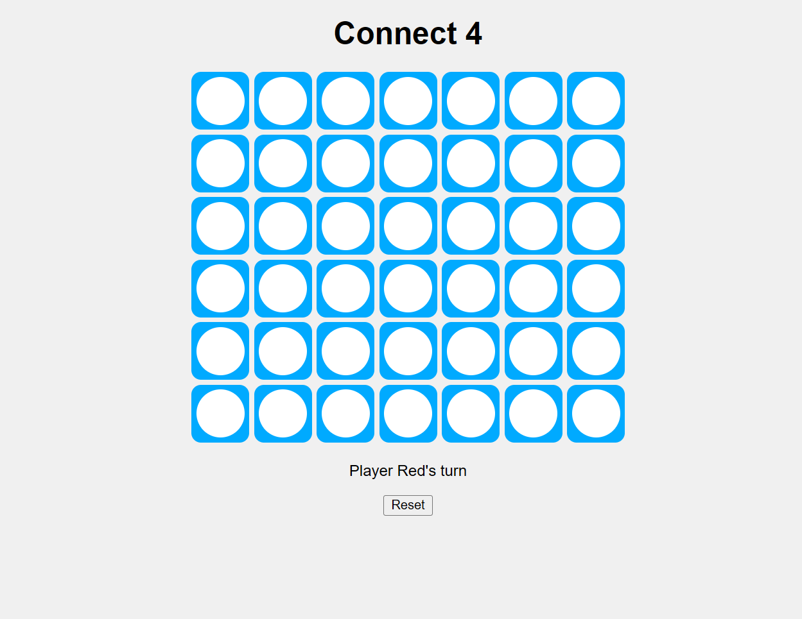

# 🎮 Connect 4 – JavaScript Game

A classic 2-player **Connect 4** game built using **HTML**, **CSS**, and **JavaScript**. This is a fun, interactive browser-based version where two players take turns dropping colored discs into a grid, trying to connect four in a row vertically, horizontally, or diagonally.

 <!-- Replace with actual screenshot -->

---

## 🚀 Live Demo

👉 [Play it Now](https://yourusername.github.io/connect4/)  
*(Replace with your GitHub Pages link)*

---

## 🧠 How to Play

- The game board is a 7-column × 6-row grid.
- Players take turns dropping **red** or **yellow** discs.
- First to connect **4 discs in a row** wins!
- Click **Reset** to start a new game.

---

## 🛠️ Technologies Used

- ✅ HTML – Structure
- 🎨 CSS – Styling the game board and discs
- ⚙️ JavaScript – Game logic, event handling, win detection

---

## 📁 File Structure
```
connect4/
│
├── index.html # Game structure
├── style.css # Game styling
└── script.js # Game logic
```

---

## 🧩 Features

- 🎯 Interactive 7x6 game grid
- 🔁 Player switching (Red ↔ Yellow)
- 🏆 Win detection logic
- ♻️ Reset game functionality
- 📱 Responsive design (basic)

---

## 📸 Screenshots

<!-- Add screenshots here -->


---

## 💡 Future Improvements

- 💻 AI opponent (single-player mode)
- 🎨 Smooth disc drop animation
- 🏅 Highlight winning discs
- 📊 Scoreboard
- 📱 Full mobile responsiveness

---

## 📥 Installation

To run the game locally:

```bash
git clone https://github.com/yourusername/connect4.git
cd connect4
open index.html  # or open in browser


